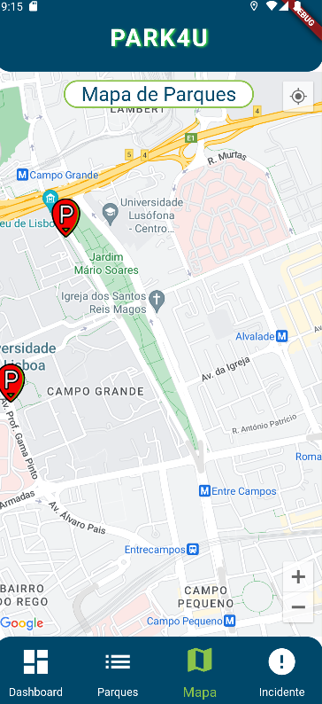
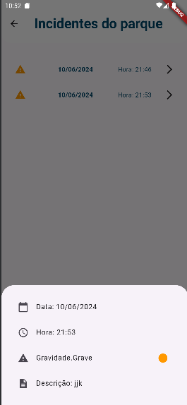

# app_estacionamento_22104735_22107603
Joana Gonçalves a22107603
Tomás Carriço a22104735

Screenshots dos ecrãs:
Ecrã da Dashboard

Ecrã de Lista de Parques

Ecrã do Mapa

Ecrã de Registar Incidente

Pop-up de confirmação do incidente registado

Ecrã de Detalhe

Ecrã de Visualização dos Incidentes do parque

Detalhe dos Incidentes

Observações: 
O botão para ver incidentes no detalhe dos parques só 
é visualizado quando o parque tem incidentes 

Identificação as funcionalidades que conseguimos implementar:
-> Arquitetura da aplicação (separação UI - Lógica de negócio, injeção de
dependências, boas práticas) - feito
-> Dashboard - feito
-> Apresentação dos parques - Lista (API Emel) - feito
-> Apresentação dos parques - Mapa 
   -> Apresentação do google maps - feito
   -> Markers com os parques (API Emel) - feito
-> Detalhe do parque 
   -> Dados do parque (API Emel) - feito
   -> Apresentar incidentes vindos da BD - feito
-> Registo de incidentes 
   -> Formulário regista na BD - feito
-> Registo de incidentes (validação do formulário) - feito
-> Geolocalização (uso apropriado nos vários ecrãs) - feito
-> Funcionamento Offline (funcionalidade avançada) - feito
-> Testes unitários / integração - feito
-> Vídeo - feito
-> Ficheiro chatgpt.txt - feito

A previsão da nota por parte dos alunos (autoavaliação): 15 valores

Arquitetura da Aplicação

A aplicação desenvolvida é um sistema de visualização de estacionamentos, incluindo funcionalidades para registo de incidentes, visualização de detalhes dos parques e integração de geolocalização em tempo real através do Google Maps. A arquitetura da aplicação segue boas práticas de desenvolvimento de software para garantir modularidade, manutenibilidade e escalabilidade.

Camadas da Aplicação

1. Apresentação (UI Layer)
    - Widgets e Ecrãs: A camada de apresentação é responsável pela interface do utilizador. Utilizamos `StatelessWidget` e `StatefulWidget` para a criação dos ecrãs, garantindo uma separação clara entre a lógica de negócios e a interface do utilizador.
    - Design Responsivo: A aplicação utiliza widgets do Flutter que se adaptam a diferentes tamanhos de ecrã, garantindo uma boa experiência do utilizador em dispositivos móveis de diferentes tamanhos.

2. Gestão de Estado
    - Provider: Utilizamos o pacote `provider` para gestão de estado. Esta abordagem facilita a comunicação entre widgets e fornece uma maneira eficiente de gerir estados globais, como a posição atual do utilizador e a lista de marcadores no mapa.

3. Lógica de Negócio (Business Logic Layer)
    - Controladores: A lógica de negócios é separada em controladores, como `controlGeo`, que gerem a localização e os marcadores no mapa. Estes controladores estendem `ChangeNotifier`, permitindo que os widgets observem mudanças de estado e atualizem a interface do utilizador conforme necessário.
    - Validação e Tratamento de Erros: A lógica de negócios inclui validações e tratamento de erros para garantir que os dados sejam processados corretamente e que o utilizador receba feedback apropriado.

4. Dados (Data Layer)
    - Repositórios: Utilizamos a arquitetura de repositórios para abstrair a fonte de dados. Por exemplo, `EstacionamentosRepository` lida com a lógica de acesso aos dados dos estacionamentos, seja de uma base de dados local ou de uma API remota.
    - Bases de Dados: O pacote `sqflite` pode ser utilizado para armazenamento local dos dados, garantindo que a aplicação funcione offline. O repositório interage com a base de dados para realizar operações CRUD.

5. Serviços
    - Geolocalização: Utilizamos o pacote `geolocator` para aceder à localização atual do utilizador. O serviço de geolocalização é encapsulado numa classe dedicada, garantindo que a lógica de localização seja facilmente testável e reutilizável.
    - Google Maps: Integrado através do pacote `google_maps_flutter`, o serviço de mapas é utilizado para exibir a localização dos estacionamentos e do utilizador em tempo real.

Boas Práticas Utilizadas

1. Separação de Preocupações (SoC): A aplicação segue o princípio de separação de preocupações, dividindo a lógica de negócios, apresentação e acesso a dados em diferentes camadas. Isto facilita a manutenção e a escalabilidade da aplicação.

2. Gestão de Estado: Utilizamos `provider` para gestão de estado, uma abordagem que facilita a atualização da interface do utilizador em resposta a mudanças no estado da aplicação. Isto também promove a reatividade e a consistência na UI.

3. Modularização: O código é dividido em módulos claros, como controladores, repositórios e widgets. Isto não só melhora a organização do código, mas também facilita os testes unitários e a reutilização de componentes.

4. Manutenibilidade: A arquitetura de repositórios e a separação da lógica de negócios garantem que o código seja facilmente testável e manutenível. Alterações na lógica de negócios ou na fonte de dados podem ser feitas sem impactar diretamente a interface do utilizador.

5. Tratamento de Erros: Implementamos um tratamento robusto de erros para lidar com falhas na obtenção de localização, acessos a dados e outras operações críticas. Isto garante que a aplicação possa fornecer feedback útil ao utilizador e continuar operando de maneira robusta.

6. Responsividade: A aplicação é projetada para ser responsiva, adaptando-se a diferentes tamanhos de ecrã e orientações, o que é crucial para uma boa experiência do utilizador em dispositivos móveis.

A arquitetura da aplicação de estacionamentos segue boas práticas de desenvolvimento de software, garantindo uma separação clara entre camadas, modularização do código, gestão eficiente de estado e uma interface de utilizador responsiva e intuitiva. Estas práticas resultam numa aplicação robusta, escalável e fácil de manter, proporcionando uma experiência de utilizador consistente e fiável.

Link para o vídeo do youtube: 

Classes de Lógica de Negócio:

Classe Estacionamento
-> Atributos**:
  -> id - String: O identificador único do estacionamento.
  -> nome - String: O nome do estacionamento.
  -> horario - String: O horário de funcionamento do estacionamento.
  -> maximoOcupacao - int: A capacidade máxima de veículos do estacionamento.
  -> atualOcupacao - int: O número atual de veículos estacionados.
  -> tipo - String: O tipo de estacionamento (e.g., subterrâneo, ao ar livre).
  -> dataAtualizada - String: A data e hora da última atualização da ocupação.
  -> distancia - double: A distância do estacionamento em relação a um ponto de referência.
  -> tarifa - String: A tarifa do estacionamento.
  -> latitude - double: A latitude da localização do estacionamento.
  -> longitude - double: A longitude da localização do estacionamento.
  -> incidentes - List<Incidente>: Uma lista de incidentes registrados no estacionamento.

-> Métodos:
  -> Estacionamento({required this.id, required this.imagem, required this.nome, required this.endereco, required this.maximoOcupacao, required this.atualOcupacao, required this.tipo, required this.dataAtualizada, required this.distancia, required this.latitude, required this.longitude, required this.tarifa}): Construtor para criar uma instância de Estacionamento.
  -> bool addIncidente(Incidente incidente): Adiciona um incidente à lista de incidentes do estacionamento. Retorna `true` se bem-sucedido e `false` em caso de erro.
  -> List<Incidente> getIncidentes(): Retorna a lista de incidentes do estacionamento.
  -> String getMaximo(): Retorna a capacidade máxima de ocupação do estacionamento como string.
  -> String getOcupacao(): Retorna a ocupação atual e a capacidade máxima como string no formato `atualOcupacao / maximoOcupacao`.
  -> factory Estacionamento.fromMap(Map<String, dynamic> map): Cria uma instância de Estacionamento a partir de um mapa de dados.
  -> factory Estacionamento.fromDB(Map<String, dynamic> db): Cria uma instância de Estacionamento a partir de um mapa de dados da base de dados.
  -> Map<String, dynamic> toDb(): Converte uma instância de Estacionamento em um mapa de dados para armazenar na base de dados.

-> Classe Incidente
-> Atributos:
  -> id - String: O identificador único do incidente.
  -> estacionamentoId - String: O identificador do estacionamento onde o incidente ocorreu.
  -> data - DateTime: A data em que o incidente ocorreu.
  -> hora - TimeOfDay: A hora em que o incidente ocorreu.
  -> descricao - String: A descrição do incidente.
  -> gravidade - Gravidade: O nível de gravidade do incidente.

-> Métodos:
  -> Incidente({required this.id, required this.estacionamentoId, required this.data, required this.hora, required this.descricao, required this.gravidade}): Construtor para criar uma instância de Incidente.
  -> factory Incidente.fromDB(Map<String, dynamic> db): Cria uma instância de Incidente a partir de um mapa de dados da base de dados.
  -> Map<String, dynamic> toDb(): Converte uma instância de Incidente em um mapa de dados para armazenar na base de dados.

-> Enum Gravidade
  -> Valores:
  - SemGravidade
  - PoucoGrave
  - Grave
  - MuitoGrave
  - ExtremamenteGrave

  -> Métodos:
  - Color getSeverityColor(Gravidade severity): Retorna uma cor baseada no nível de gravidade.
  - String gravidadeText(double value): Converte um valor numérico em texto representando a gravidade.
  - Gravidade getGravidade(double value): Converte um valor numérico num enum Gravidade.

Fontes de informação:
geo-localizaçao : https://www.youtube.com/watch?v=TruOM8pB2_k&list=PL_wKlpKIC9vWCRIgMvH8pbRmX8XVouRv1&index=37
google maps : https://www.youtube.com/watch?v=l_nLqPK7K6Q&list=PL_wKlpKIC9vWCRIgMvH8pbRmX8XVouRv1&index=39
stackoverflow : https://stackoverflow.com/questions/46728408/error-elements-containselement-is-not-true
GitHub : https://github.com/flutter/flutter/issues/40260
Site flutter : https://docs.flutter.dev/testing/common-errors
