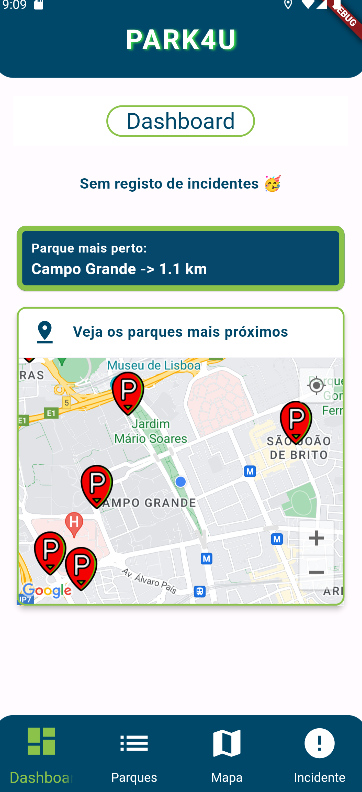
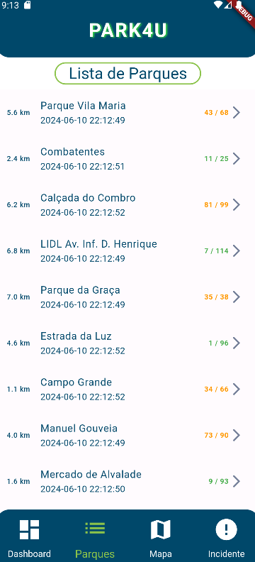
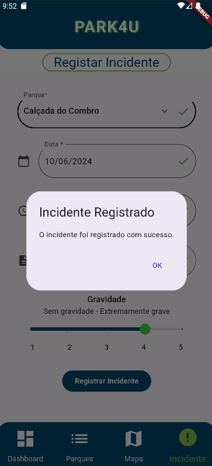
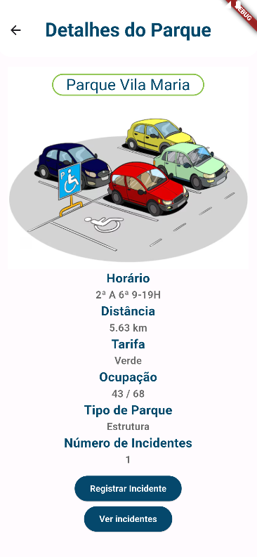
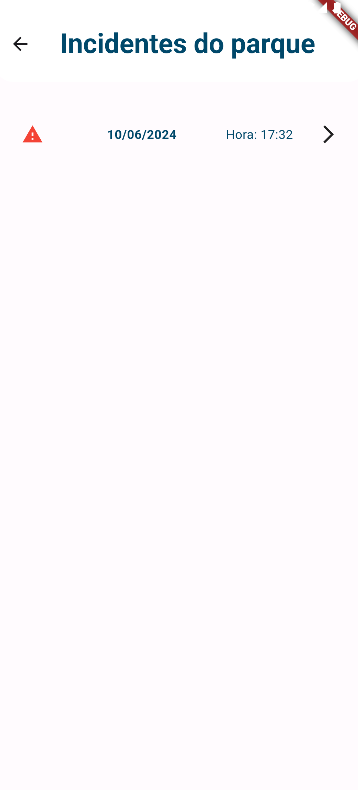

# app_estacionamento_22104735_22107603
Joana Gonçalves a22107603
Tomás Carriço a22104735

Screenshots dos ecrãs:
Ecrã da Dashboard

Ecrã de Lista de Parques

Ecrã do Mapa

Ecrã de Registar Incidente

Pop-up de confirmação do incidente registado

Ecrã de Detalhe

Ecrã de Visualização dos Incidentes do parque

Detalhe dos Incidentes

Observações: 
O botão para ver incidentes no detalhe dos parques só 
é visualizado quando o parque tem incidentes 

Identificação as funcionalidades que conseguimos implementar:
-> Dashboard - feito
-> Apresentação dos parques - Lista - feito
-> Apresentação dos parques - Mapa (imagem) - feito
-> Detalhe do parque - feito
-> Detalhe do parque (apresentar incidentes) - feito
-> Registo de incidentes - feito
-> Registo de incidentes (validação do formulário) - feito
-> Navegação - feito
-> Arquitetura da aplicação (separação UI - Lógica de negócio) - feito

A previsão da nota por parte dos alunos (autoavaliação): 17 valores